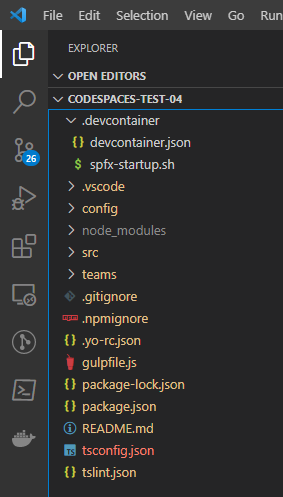
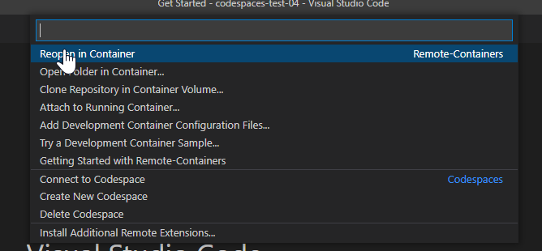
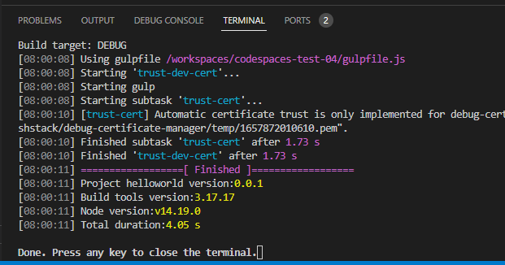
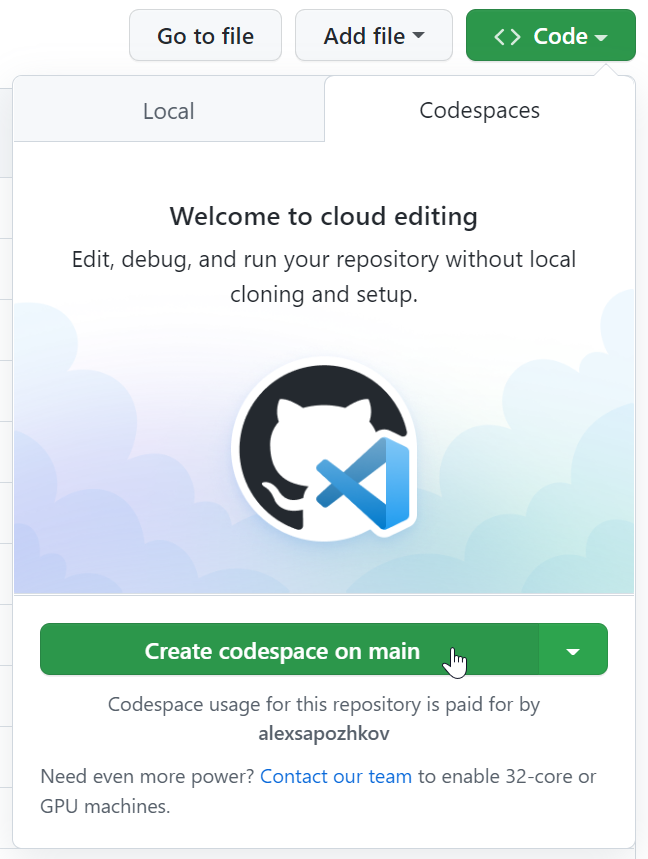

# Using m365pnp/spfx Image in Visual Studio Development Containers

Visual Studio Code development containers allows you to work with SPFx solutions in containers that Visual Studio will run automatically for you so you don't need to care running `docker run`. In this it is also easier to make sure that all members of the project are using the same development environment.

## Prerequisites

There might be two options of using Visual Studio Code development containers with m365pnp/spfx image:

- Using locally installed Docker, on your desktop/laptop
- Running containers in cloud using GitHub Codespaces (requires a paid GitHub plan)

When you run in a development container in GitHub Codespaces, you do NOT need to install any of the following on your laptop/desktop:

- Node.js
- yeoman
- gulp
- Docker
- git

What you will need locally is only Visual Studio!

### Locally Installed Docker

For using that option you need to have locally installed the following software:

- Visual Studio Code
- Visual Studio Code extension, Remote - Containers https://marketplace.visualstudio.com/items?itemName=ms-vscode-remote.remote-containers
- Docker Engine
- SPFx solution code, scaffolded in the root directory

### GitHub Codespaces

This option requires the following:

- Visual Studio Code
- Visual Studio Code extension, Remote - Containers, https://marketplace.visualstudio.com/items?itemName=ms-vscode-remote.remote-containers
- Git repository in a GitHub organization with enabled Codespaces, https://docs.github.com/en/codespaces/managing-codespaces-for-your-organization/enabling-github-codespaces-for-your-organization
- SPFx solution code, scaffolded in the root directory

## Defining Development Containers for the Project

1. In the root folder of the source code, create the folder called `.devcontainer`.

2. In this folder, create the `devcontainer.json` file with the following contents:

```json
// For more information on how to run this SPFx project in a VS Code Remote Container, please visit https://aka.ms/spfx-devcontainer
{
	"name": "SPFx 1.15.0",
	"image": "m365pnp/spfx:1.15.0",
	// Set *default* container specific settings.json values on container create.
	"settings": {},
	// Add the IDs of extensions you want installed when the container is created.
	"extensions": [
		"editorconfig.editorconfig",
		"dbaeumer.vscode-eslint"
	],
	// Use 'forwardPorts' to make a list of ports inside the container available locally.
	"forwardPorts": [
		4321,
		35729
	],
	"portsAttributes": {
		"4321": {
			"label": "Manifest",
			"requireLocalPort": true
		},
		"35729": {
			"label": "LiveReload",
			"requireLocalPort": true
		}
	},
	"postCreateCommand": "bash .devcontainer/spfx-startup.sh",
	"remoteUser": "node"
}
```

3. In the same folder create the `spfx-startup.sh` file with the following contents:

```sh
echo
echo -e "\e[1;94mInstalling Node dependencies\e[0m"
npm install

## commands to create dev certificate and copy it to the root folder of the project
echo
echo -e "\e[1;94mGenerating dev certificate\e[0m"
gulp trust-dev-cert
```

This is the structure that you should have:



## Starting working with SPFx when you run Docker locally

1. Open the folder in Visual Studio Code
2. Click in the bottom left corner:


3. Select `Reopen in Container`:



4. Wait until the Node.js modules are installed:



5. Type `gulp serve --nobrowser` in the Visual Studio Code terminal

6. Add the SSL certificate as trusted on your system. For example, if you use Windows, run the following PowerShell snippet:

```powershell
$tcpClient = New-Object -TypeName System.Net.Sockets.TcpClient;
$tcpClient.Connect("localhost", 4321);
$tcpStream = $tcpClient.GetStream();
$callback = { param($sender, $cert, $chain, $errors) return $true };
$sslStream = New-Object -TypeName System.Net.Security.SslStream -ArgumentList @($tcpStream, $true, $callback);
$sslStream.AuthenticateAsClient('');
$certificate = $SslStream.RemoteCertificate;
$x509Certificate = New-Object -TypeName System.Security.Cryptography.X509Certificates.X509Certificate2 -ArgumentList $certificate
$store = new-object System.Security.Cryptography.X509Certificates.X509Store(
    [System.Security.Cryptography.X509Certificates.StoreName]::Root,
    "localmachine"
)
$store.open("MaxAllowed");
$store.add($x509Certificate);
$store.close();
```

7. Now you should be able to access the workbench

## Starting working with SPFx when you run containers remotely in GitHub Codespaces

1. Open the project in GitHub site.
2. Click `Code` button:


3. Click `Create codespace on ...` button:



4. Click `Open this codespace in VS Code Desktop`:


5. Confirm opening Visual Studio Code:


6. Type `gulp serve --nobrowser` in the Visual Studio Code terminal

7. Add the SSL certificate as trusted on your system. For example, if you use Windows, run the following PowerShell snippet:

```powershell
$tcpClient = New-Object -TypeName System.Net.Sockets.TcpClient;
$tcpClient.Connect("localhost", 4321);
$tcpStream = $tcpClient.GetStream();
$callback = { param($sender, $cert, $chain, $errors) return $true };
$sslStream = New-Object -TypeName System.Net.Security.SslStream -ArgumentList @($tcpStream, $true, $callback);
$sslStream.AuthenticateAsClient('');
$certificate = $SslStream.RemoteCertificate;
$x509Certificate = New-Object -TypeName System.Security.Cryptography.X509Certificates.X509Certificate2 -ArgumentList $certificate
$store = new-object System.Security.Cryptography.X509Certificates.X509Store(
    [System.Security.Cryptography.X509Certificates.StoreName]::Root,
    "localmachine"
)
$store.open("MaxAllowed");
$store.add($x509Certificate);
$store.close();
```

8. Now you should be able to access the workbench

## Possible Issues

### Port Mapping

Make sure that in Visual Studio Code local ports are allocated correspondingly:


If the local ports are busy with something else before you open the project in the development container, Visual Studio will allocate random ports instead.
