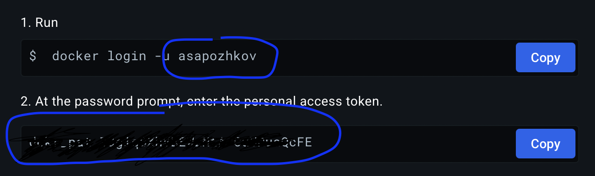
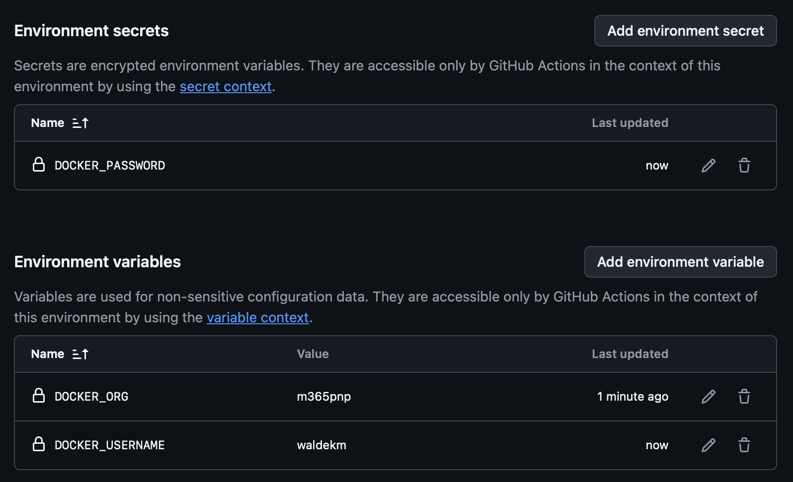

# Continuously build and push images to Docker Hub

## Preparing the repo

1. Open `Personal access tokens` in Docker Account Center: https://app.docker.com/settings/personal-access-tokens
2. Click `Generate new token`
3. Enter some description
4. Select `Read & Write` in `Access permissions`
5. Click `Generate`
6. You will see the page with your user name and token string. You will need these attributes for the following steps.

7. Open Environments in Settings of the Github project: https://github.com/pnp/docker-spfx/settings/environments
8. Create a new invironment called `DockerHubProd`
9. Add necessary protection to the environment. For example, you can choose `Protected branches only` so only commits merged to `master` branch will be able to have access for publishing images to Docker Hub
10. Create `DOCKER_ORG` environment variable and set value to `m365pnp`.
11. Create `DOCKER_USERNAME` environment variable and set value that you got in the Docker page above.
12. Create `DOCKER_PASSWORD` environment secret and set value that you got in the Docker page above.

Here is how an example of how the result may look:

## Triggering the build

Create and push a git tag. Image will be pushed to Docker Hub with the same tag, and also with `latest` and `online` tags.
